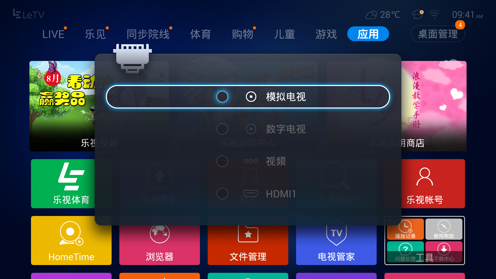
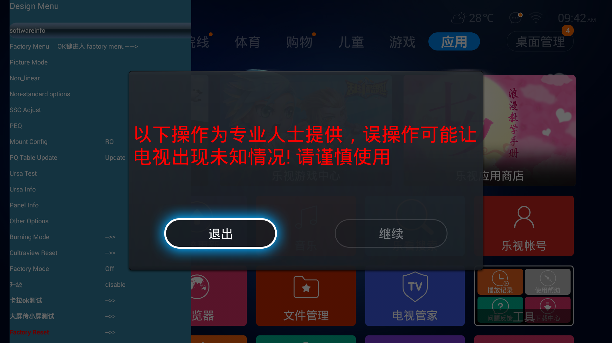
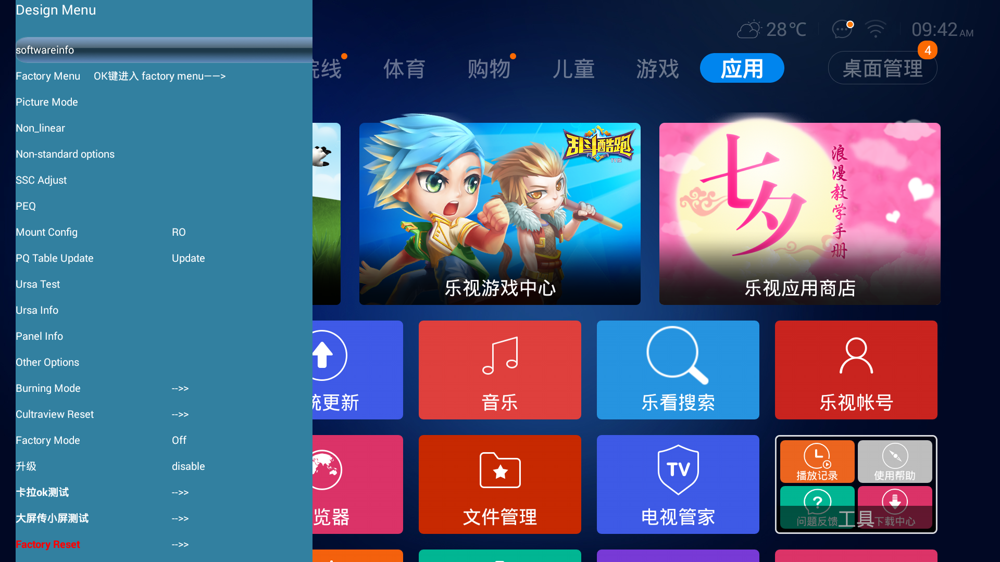
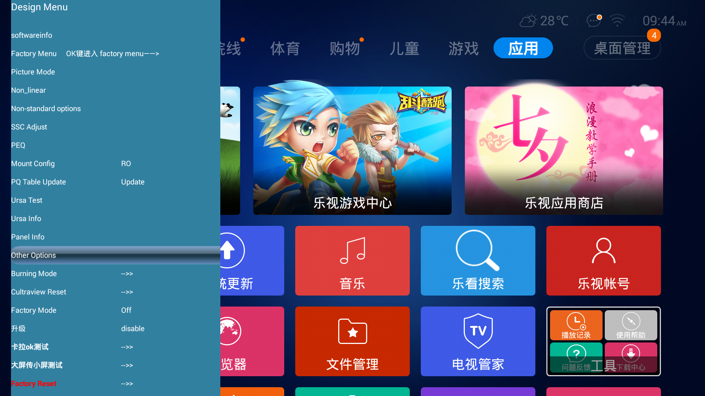
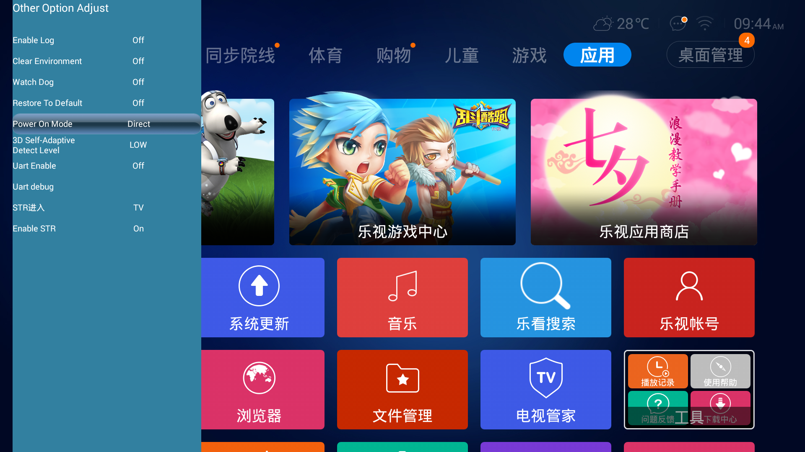

# 乐视tv设置插电自启

## 遥控器按"信号源"

## 依次按数字键 2 5 7 0

## 按"右方向键",会高亮"继续"字样,然后按"确定".

## 按"下方向键"多次, 高亮"Other Options",然后按"确定"

## 按"下方向键"多次, 高亮"Power On Mode", 然后按"右方向键",直至变成"Direct"

## 反复按"返回",然后断电重新插电即可