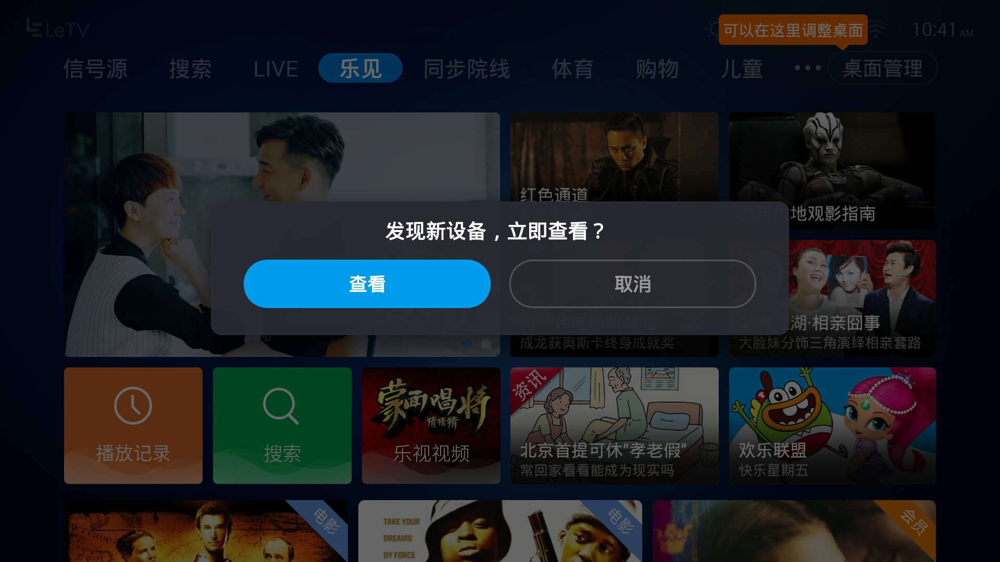
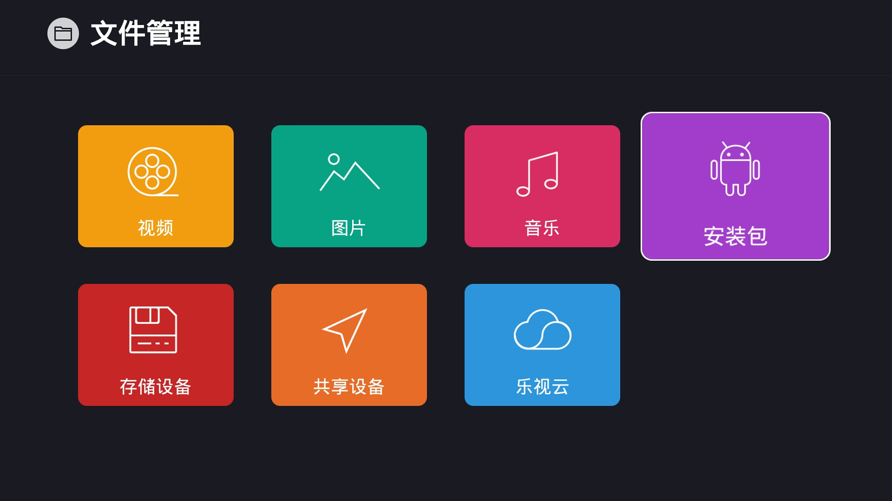
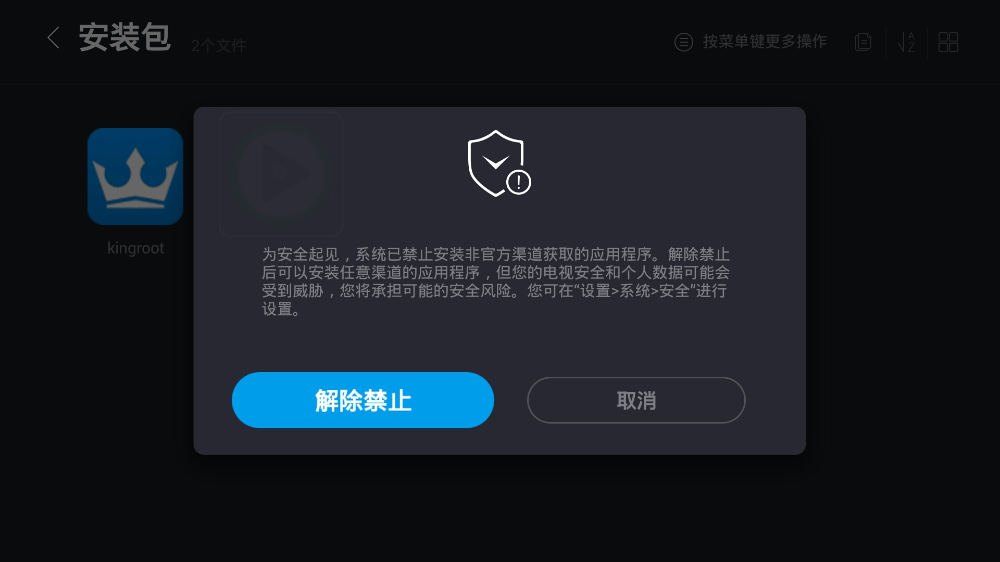
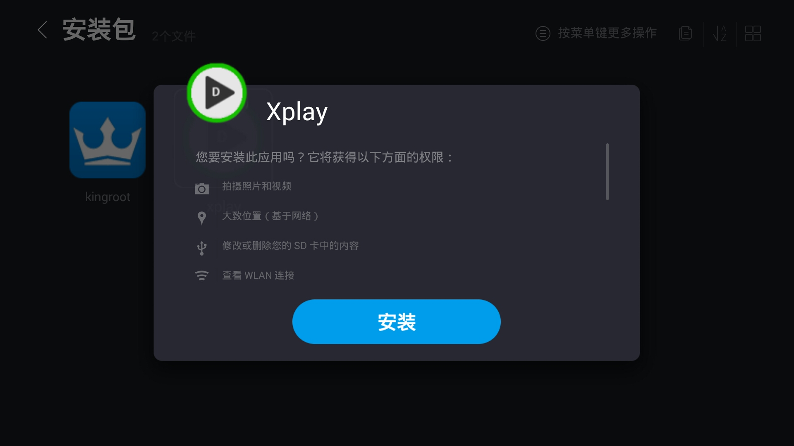
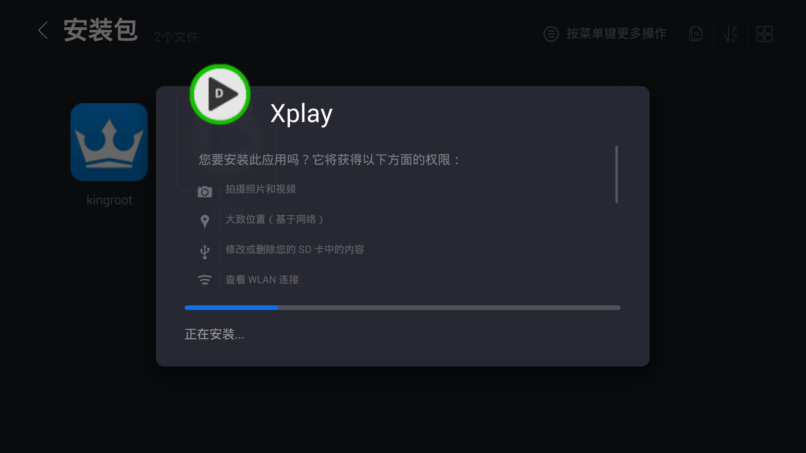
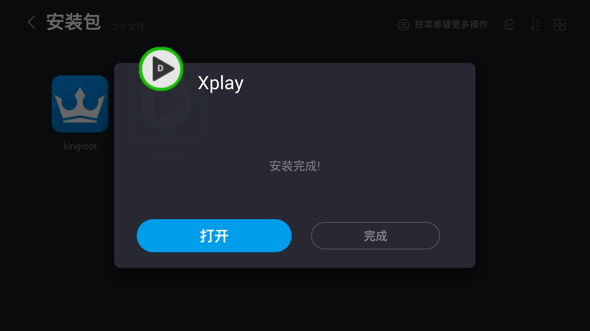

# Xplay安装指南(以乐视电视为例)

### 从官网下载xplay.apk后放入U盘,插入智能电视的USB口,即弹出对话框

### 选中查看,按确定,进入文件类型选择框,选择"安装包",然后按确定

### 选中xplay安装包,按确定

### 第一次安装U盘上的apk会提示风险,请选择"解除禁止"

### 提示xplay所需要的权限,按"安装"

### 安装中,一般耗时30秒

### 提示安装完成, 选择"打开"

### 出现默认底图,请留意屏幕底部的状态及ip. 若出现Root权限提示框,请务必选择允许

### 二维码出现,请使用微信扫一扫功能进行扫码. 第一次使用请确认关注.

### 扫码完成后,程序将自动注册并下载默认素材,通常在一分钟内完成

## 常见问题

* 没有出现二维码 -- 请检查网络连接, 第一次注册建议使用网线.
* 扫码完成后没有动静 -- 请拍照并联系客服人员